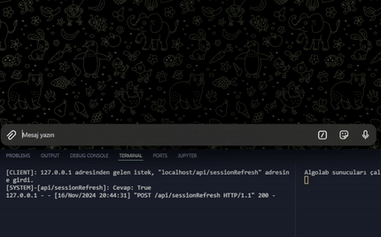
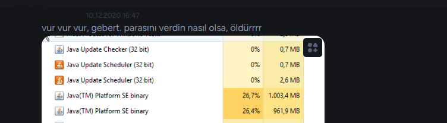

# hisseYakinTakip

Ellerin trade botu var da, bizim başımız kel mi? 🤔

### Bilgi
hisseYakinTakip, temelinde 3 modülden oluşan bir hisse al-sat botudur. Amacı kullanıcının belirlediği amaca göre portföy yönetimi yapmak veya kısa vadeli al-sat işlemleri yapmaktır. Şuanda proje kodları gizlidir.

### Çalışma mantığı
Belirlenen amaca dayalı olarak, seans öncesinde ve seans sırasında belirli aralıklarla hisse senetlerinin fiyatlarını kontrol eder. Eğer belirlenen kriterler sağlanıyorsa alım-satım işlemleri gerçekleştirir.

Seans öncesi hisselerin periyodik fiyatlarını çekip analiz yapar. Seans başlamadan önce kullanıcıya özet bilgi gönderir. Seans sırasında ise amaca göre basitce al-sat yapar.

### Modüller
hisseYakinTakip programı 3 modülden oluşmaktadır:
- **☁️algoService**: DenizBank altyapısına bağlı olan algolab.com ile, MobilDeniz uygulamasından yapılacak neredeyse bütün işlemleri yapabilen modül.
    - getTodaysTransaction, getCandleData, riskSimulation, sendOrder, getPortfolio gibi 13 farklı fonksiyonu bulunmaktadır.
    - [flask](https://flask.palletsprojects.com/en/2.0.x/) tabanlı bir API servisi ile çalışır.
    - Bütün giriş-çıkış* işlemleri [Fernet](https://cryptography.io/en/latest/fernet/) kütüphanesi ile şifrelenir. Wireshark gibi araçlarla dinlenemez.
- **➗libService**: Grafik çizim, analiz ve hesaplama gibi algoService'in yükünü hafifletip hızlandırmak amacıyla oluşturulan asistan modül.
    - [plotly](https://plotly.com/python/) ve [matplotlib](https://matplotlib.org/) kütüphaneleri ile grafiksel öngörüler yapar.
    - Kullanıcıya bütün grafik içeren bilgilerin ve diğer modüllerin işine yarayacak fonksiyonlar içerir.
    - Diğer modüllerin aksine tek .py dosyasıdır ve gelen-giden bilgileri şifrelemez.
    - Mum çubuğu, çizgi, çubuk grafikleri çizer. Ayrıca bu grafiklerin üzerine işaretçi, trend çizgisi, destek-direnç çizgileri ekler. Ayrıca bu bilgilerin işlenmesini ve al-sat işlemleri için yardım eder.
- **📨telegService**: Kullanıcının bire-bir iletişim kurabileceği, al-sat işlemlerini takip edebileceği ve programın genel durumu hakkında bilgi alabileceği Telegram botu modülü. @BotFather'ın verdiği token ile çalışır.
    - Kullanıcının verdiği emirleri alır ve ilgili modüllere iletir.
    - Botun bildirimlerini, işlemlerini ve hatalarını kullanıcıya bildirir.


### Kullanım
Şuan için sadece verilen emirleri (sat-takip_et-al) emirlerini yerine getirir. İleride tam otomatik portfoy yönetimi yapması planlanmaktadır.

Botun çalışması üç bilgi gerekir:
```json
{
    "algoService": {
        "username": "denizbank_username",   # Ya da algolab_username
        "password": "denizbank_password"    # Ya da algolab_password
    },
    "telegService": {
        "token": "telegram_bot_token"       # @BotFather
    }
}
```
Daha sonra işlemler Telegram üzerinden yapılır.

### Resimler
- AlgoLab hizmetlerinin ve ☁️ algoService kontrolü

    

- Get Instant Position & Anlık Pozisyon Bilgisi

    

- Hızlıca alım yapma

    


- 1 aylık grafik oluşturma ve taban-tavan çizgileri

    
    
### Anahtar özellikler
- **Kullanıcı dostu**: Kullanıcı sadece Telegram üzerinden komut göndererek yönetir. 
- **Modüler yapı**: Programın her bir modülü birbirinden bağımsızdır. Bu sayede her bir modülü ayrı ayrı test edilebilir. Bakım yapılırken sistemi tümden kapatmaya gerek kalmaz.
- **Güvenli**: Bütün iletişim şifreli olarak yapılır. AlgoLab API bağlantıları, servislerin birbirleriyle olan iletişimleri(libService hariç) tam şifreli olarak yapılır. WireShark gibi araçlarla dinlenemez.

### Detaylı Bilgi
- Kiraladığım VDS'in gözetlenmesinden dolayı, python kodunun .exe koduna derlemem gerekti ve çözüm olarak [Nutika](https://nuitka.net/) ile derledim. Ancak bazı python kütüphanelerin (matplotlib, plotly) derleme sırasında Nuitka'yı çok zorladığını gördüğüm için modüler yapıya geçtim. Böylelikle ana modüller derlendi, sadece libService modülü python olarak bırakıldı.

    

- ☁️ algoService modülü [@atillayurtseven/AlgoLab](https://github.com/atillayurtseven/AlgoLab) Hocanın reposu üzerine inşaat edildi. Ek olarak API üzerinden gelen bilgilerin filtrelenmesi ve modüllerin birbirleriyle iletişim kurarken izlenememesi için şifreleme yapıldı. Şifrelemeler için [Fernet](https://cryptography.io/en/latest/fernet/) kütüphanesi kullanıldı. 

- ☁️ algoService modülü, esneklik için [multiprocessing](https://docs.python.org/3/library/multiprocessing.html) kütüphanesi ile yazıldı. Ancak şuanda başka bir yaklaşım planladığım için projeden çıkardım.

- Bazı takip edilen özellikler için MongoDB kullanıldı. Tam olarak gerekli değildi ancak MongoDB'nin nasıl çalıştığını görmek ve öğrenmek için kullanıldım.

- Güvenlik olarak algoLib ile bağlantı kurulması için gönderilen istek dışında ek olarak 32 basamaklı şifre  kullanıldı. Böylelikle sadece sunucu dışından gelecek bağlantılar filtrelendi.
    ```python
    try:
            data = json.loads(fernet.decrypt((encrypted_data)).decode('utf-8'))
            password_fetched, symbol, direction, lot = (data.get(key) for   key in ["password", "symbol", "direction", "lot"])

            if password_fetched == password:
                [...]
    ```

- Ayrıca ☁️ algoService'a gelen bağlantıların IP adresleri kayıt edilir. Eğer bilinmeyen/güvenilmeyen bir IP adresinden bağlantı gelirse, bağlantı reddedilir ya da Telegram üzerinden bilgi verilir.
    ```python
    @app.route('/api/sendOrderFast', methods=['POST'])
    def sendOrderFast():
        Firewall(request.remote_addr)
    ```

- AlgoLab hizmetlerine giriş yapılırken username-password bilgileri onaylandıktan sonra sisteme kayıtlı olan telefon numarasına bir SMS gönderilir. Bu SMS'te bir kod bulunur ve bu kod, kullanıcıdan istenir. Eğer doğru kod girilirse AlgoLab hizmetlerine giriş için token üretilir.
    ```python
    # https://algolab.com.tr/ALGOLAB_API_DOCUMENT.pdf
        2. RESTAPI
            Kullanıcı Girişi Sms Alma
            Internet Bankacılığı bilgileri ile giriş yapmanızı sağlar. İstek sonunda sistemde kayıtlı telefon numaranıza Sms gelir.
            Gelen Sms’ teki kod ile bir sonraki işlem gerçekleştirilecektir.
            
            Http İsteği
                • POST /api/LoginUser
            Http Headers
                Content-Type: application/json
                APIKEY: Başvuru Sonucu Alınan APIKEY
    ```
    Bu işlemin otomatikleştirilmesi için, [SMS_Fetcher](https://github.com/lavrensiyum/big.LITTLE.programs/tree/main/SMS_Fetcher) modülünü yazdım. Bu modül ile iOS işletim sistemlerinde, gelen DENIZBANK SMS'lerinden 6 basamaklı kod çekilip sunucuya gönderilir. Bu sayede ☁️ algoService modülü, kullanıcıdan ekstra bir bilgi istemeden giriş yapar. Özellikle akşam seansı bittikten sonra veya bakım gibi öngörülemeyen durumlarda sistem kendini otomatik olarak yeniden başlatır.
